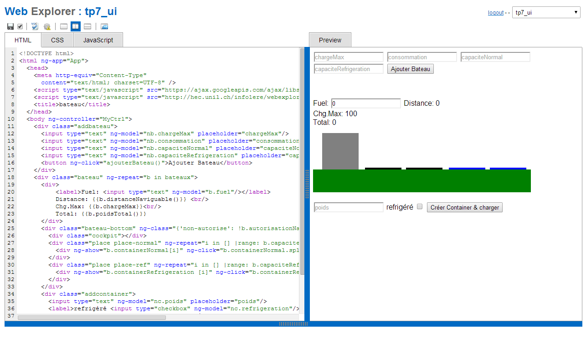

WebExplorer
============

Simple online WebEditor and support system for CS course.

Built with CakePhp 1.3 and Postgresql.

Screenshots
----------------

[More screens](https://github.com/bfritscher/webexplorer/wiki/Screenshots)

Some Pointers
--------------------
Simple HTML/CSS/JS editor uses codemirror with Zen coding plugin

User assignments management and grading assist

### Pages
Each user has his own workspace where he can create virtual files.

Administrator have their personal space and a shared space. Pages can be moved between personal and shared space, as well as added to a public sample space from where users can copy.

Edits are saved automatically, but can also be done manually by clicking the save icon. Manual saves are stored as individual snapshots from which a version can be restored under url: /webexplorer/snapshots/[pagename]

### Assignments
Assignments can be added in controller/webexplorer_controller.php with a submission date. If a page with the same name is created a user will see a button to submit his assignment.

Different Page templates can be added to views/webexplorer/edit.ctp

Assignments can be require to be syntactically valid before their submission is accepted. For this some configuration of external validation is required see the function __isHtmlAndCssValid in webexplorer_controller.php

There are some dashboard and stats pages to help in  submission assessments (number of pages graded by each admin, duplicate identification, ...)
